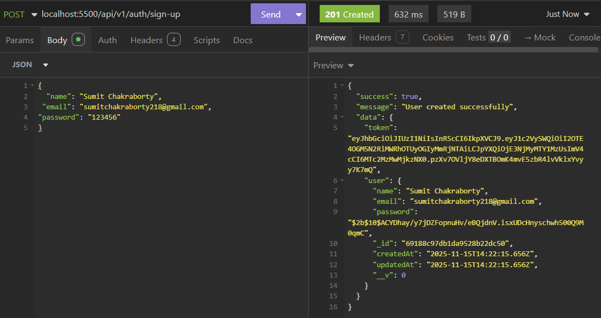
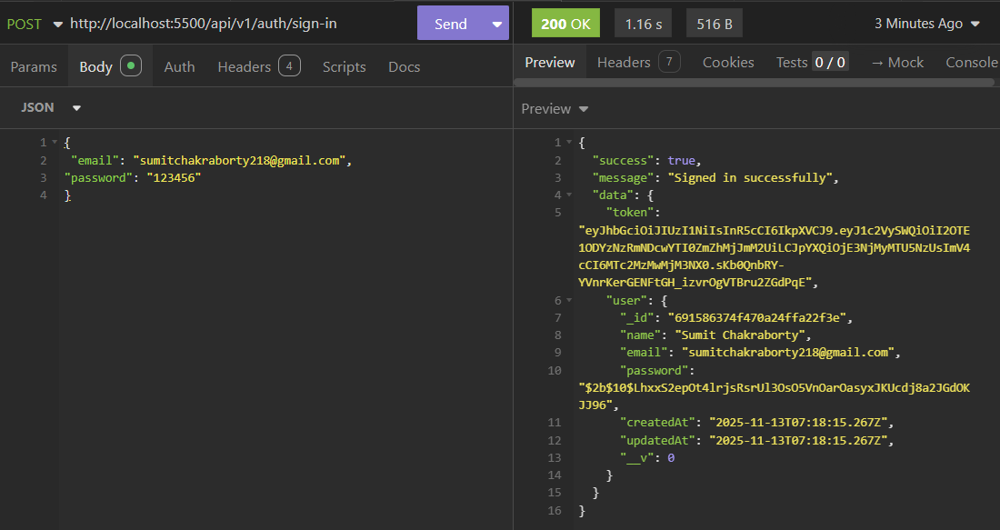
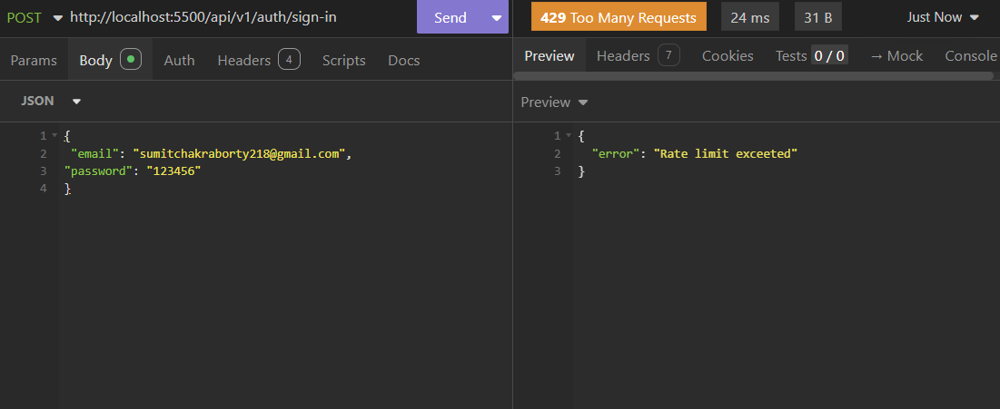
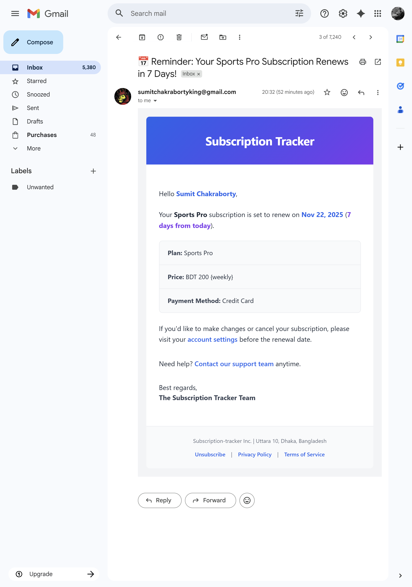

# 🔄 A Subscription Management System API

A modern Node.js + Express + MongoDB application for managing subscriptions, users, and subscription plans — the backend API powering a subscription-based platform.

## 📋 <a name="table">Table of Contents</a>

1. 📘 [Introduction](#introduction)
2. ⚙️ [Tech Stack](#tech-stack)
3. ⭐ [Features](#features)
4. 🚀 [Quick Start](#quick-start)
5. 💻 [Snippets (Code to Copy)](#snippets)
6. 📸 [Demo](#Demo)
7. 🔗 [Links](#Links)

## <a name="introduction">📘 Introduction</a>

A Subscription Management System API built with Node.js, Express, and MongoDB.
It provides secure user authentication, subscription handling, and structured data modeling with Mongoose.
The system includes production-grade features such as rate limiting, bot protection, centralized error handling, logging, and automated email workflows.

## <a name="tech-stack">⚙️ Tech Stack</a>

- Node.js
- Express.js
- MongoDB

## <a name="features">⭐ Features</a>

🔐 **Advanced Security Controls:** Arcjet integration provides bot protection and rate-limiting capabilities throughout the system.

📨 **Automated Email Notifications:** Upstash Workflows enable scheduled and event-driven reminder emails.

🗃️ **Database Modeling:** MongoDB and Mongoose are used to define structured models and establish clear relationships.

🎫 **JWT-Based Authentication:** Secure token-based workflows support user management and subscription operations.

⚠️ **Centralized Error Handling:** Unified validation, structured error responses, and middleware-driven processing ensure consistent behavior across the API.

🔧 **Modular Architecture:** The codebase is organized for scalability, maintainability, and reusability across different parts of the application.

## <a name="quick-start">🚀 Quick Start</a>

**Prerequisites**

- Git
- Node.js
- npm
- MongoDB

**Clone the repository**

```bash
git clone https://github.com/Sumit-531/Subscription-Tracker.git
cd Subscription-Tracker
```

**Installation**

Install the project dependencies using npm:

```bash
npm install
```

**Set Up Environment Variables**

Create a file named .env.local in the root directory of the project and add the required environment variables as shown below:

```env
# PORT
PORT=5500
SERVER_URL="http://localhost:5500"

# ENVIRONMENT
NODE_ENV=development

# DATABASE
DB_URI=

# JWT AUTH
JWT_SECRET=
JWT_EXPIRES_IN="1d"

# ARCJET
ARCJET_KEY=
ARCJET_ENV="development"

# UPSTASH
QSTASH_URL=http://127.0.0.1:8080
QSTASH_TOKEN=

# NODEMAILER
EMAIL_PASSWORD=
```

**Running the Project**

```bash
npm run dev
```

**Test the API**

After starting the server, the API will be accessible at:
[http://localhost:5500](http://localhost:5500)
Requests can be made through a web browser or any HTTP client (e.g., Insomnia, Postman) to verify the endpoints.

## <a name="snippets">💻 Snippets</a>

<details>
<summary><code>Dummy JSON Data</code></summary>

```json
{
  "name": "Sports Pro",
  "price": 200,
  "currency": "BDT",
  "frequency": "weekly",
  "category": "sports",
  "startDate": "2025-11-15T00:00:00.000Z",
  "paymentMethod": "Credit Card"
}
```

</details>

## <a name="demo">📸 Demo</a>


_Example response returned by the API when creating a new user account._


_Example response returned by the API when signing in an existing user._


_Example showing Arcjet enforcing rate limits when too many API requests are made._

  
_Automated subscription reminder email example._

## <a name="links">🔗 Links</a>

- **Arcjet** - [https://arcjet.com/](https://arcjet.com/)
- **Upstash** - [https://upstash.com/](https://upstash.com/)
- **MongoDB** - [https://www.mongodb.com/](https://www.mongodb.com/)
- **Node.js** - [https://nodejs.org/en](https://nodejs.org/en)
